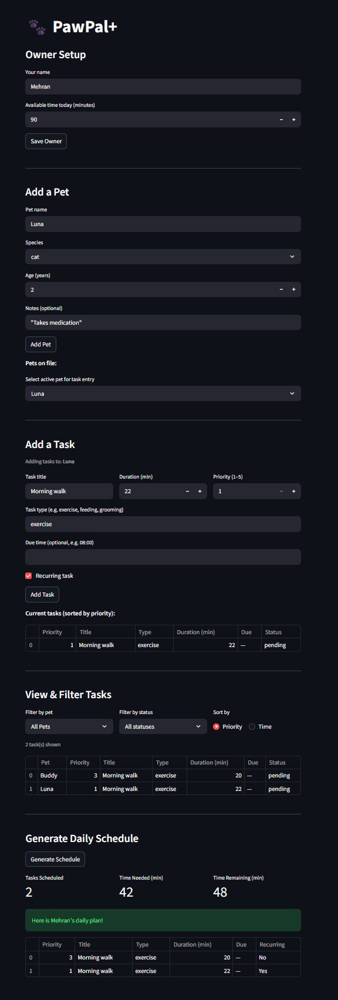

# PawPal+ (Module 2 Project)

You are building **PawPal+**, a Streamlit app that helps a pet owner plan care tasks for their pet.

## Scenario

A busy pet owner needs help staying consistent with pet care. They want an assistant that can:

- Track pet care tasks (walks, feeding, meds, enrichment, grooming, etc.)
- Consider constraints (time available, priority, owner preferences)
- Produce a daily plan and explain why it chose that plan

Your job is to design the system first (UML), then implement the logic in Python, then connect it to the Streamlit UI.

## What you will build

Your final app should:

- Let a user enter basic owner + pet info
- Let a user add/edit tasks (duration + priority at minimum)
- Generate a daily schedule/plan based on constraints and priorities
- Display the plan clearly (and ideally explain the reasoning)
- Include tests for the most important scheduling behaviors

## Getting started

### Setup

```bash
python -m venv .venv
source .venv/bin/activate  # Windows: .venv\Scripts\activate
pip install -r requirements.txt
```

### Suggested workflow

1. Read the scenario carefully and identify requirements and edge cases.
2. Draft a UML diagram (classes, attributes, methods, relationships).
3. Convert UML into Python class stubs (no logic yet).
4. Implement scheduling logic in small increments.
5. Add tests to verify key behaviors.
6. Connect your logic to the Streamlit UI in `app.py`.
7. Refine UML so it matches what you actually built.

## Smarter Scheduling

PawPal+ now includes smarter scheduling features to make task planning more useful. Tasks can be sorted by time, filtered by pet name or completion status, and checked for scheduling conflicts. The scheduler can also detect overlapping tasks and return warning messages instead of failing. In addition, recurring tasks can be recreated automatically for the next occurrence when a daily or weekly task is completed.


## Testing PawPal+
The test suite for PawPal+ was written with pytest and is focused on verifying the core backend logic of the system.

Run the tests with:

python -m pytest

The current tests cover:

task completion and task addition
sorting tasks by time
filtering tasks by pet name and completion status
recurring task creation for daily and weekly tasks
conflict detection for overlapping task times
daily plan generation under time and status constraints

These tests include both normal usage cases and edge cases, such as pets with no tasks, missing due times, adjacent tasks that should not conflict, and tasks that exceed the owner’s available time.

Confidence Level: (4/5)

The current confidence level is 4 out of 5 because the backend logic is tested well across the main scheduling features, but the tests do not fully cover UI behavior, invalid user input, or more advanced real-world scheduling scenarios.

That confidence level is the one I choose. Not 5 out of 5, because even a good backend suite does not prove the whole app is flawless.

## Features
Priority-first task sorting: Tasks are sorted by priority, then by due time, so more important tasks are considered first in the daily plan.

Sorting by time: Tasks can also be sorted chronologically by due time, with tasks that have no due time placed at the end.

Filtering by pet and status: Tasks can be filtered by pet name and by task status, making it easier to view only the relevant tasks.

Time-constrained daily planning: The scheduler greedily fits pending tasks into the owner’s available time budget and skips tasks that do not fit.

Conflict detection and warnings: The scheduler detects overlapping task time windows and returns human-readable warnings instead of failing.

Recurring task creation: When a daily or weekly task is completed, the scheduler can automatically create the next occurrence with the correct next date.

Human-readable plan explanation: explain_plan() generates a formatted summary of the daily plan, including selected tasks and detected conflicts.

Multi-pet support: One owner can manage multiple pets, and the scheduler builds plans across all of them.

Live task status tracking: Each task stores a TaskStatus value such as PENDING, COMPLETE, or SKIPPED, and task status can be updated during use.

Dynamic task updates: Task attributes can be changed at runtime using update_task(**kwargs).

## Demo



<a href="/course_images/ai110/pawpal_screenshot.png" target="_blank">
  
</a>